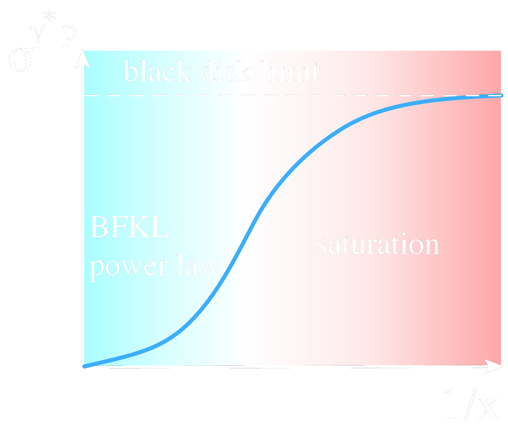
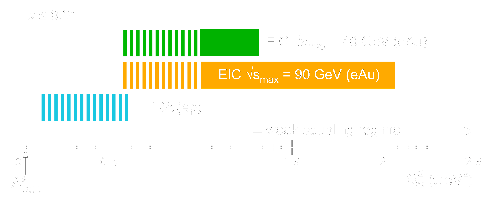
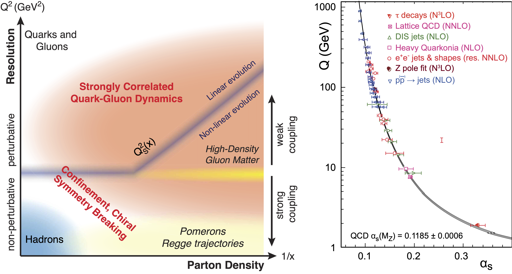
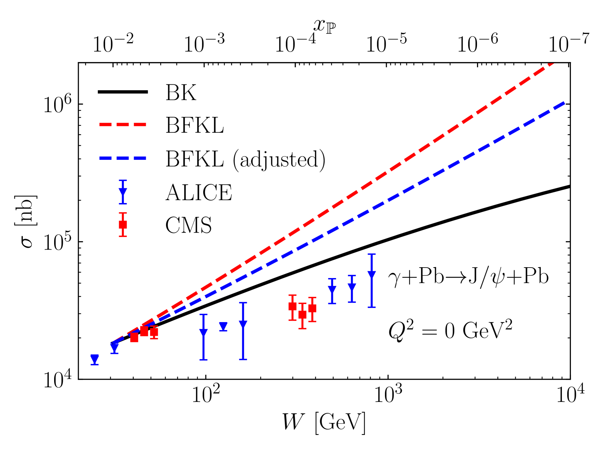
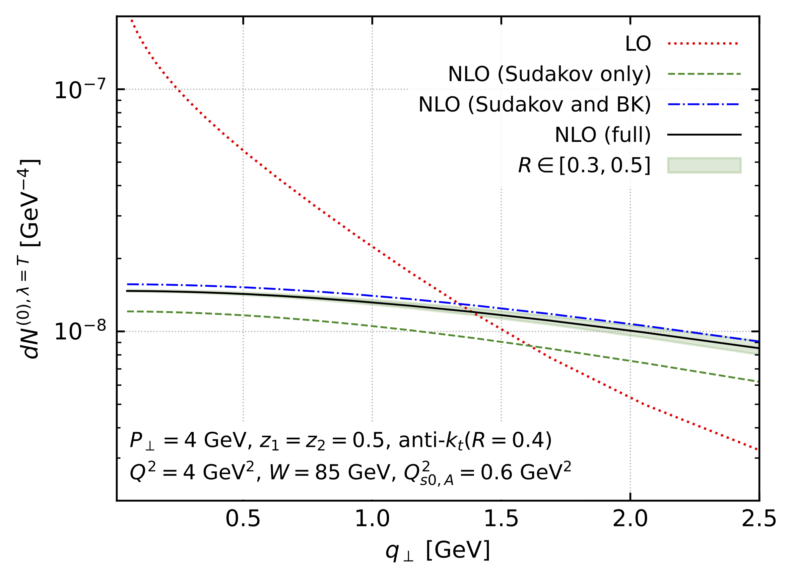
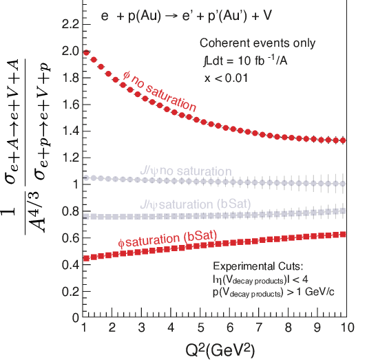

# Gluon saturation: theory overview <!-- .element: class="r-fit-text" -->

Vladi Skokov

North Carolina state University

_Supported by DOE grant DE-SC002008 and SURGE Topical collaboration_

---

## Outline

- ads

- ads

- asd

---

### Gluon density at small x

---

### Evolution eqns: radiation dominated regime

- BFKL equation resums powers of $\alpha_s \ln \frac{1}{x}$; no multiple
  rescattering

$$
\frac{ \partial } {\partial \ln \frac{1}{x} } N (x, k^2) = \alpha_s N_c\  K_{\rm BFKL} \otimes N(x, k^2)
$$

I. Balitsky, V. Fadin, E. Kuraev,  L. Lipatov, '78

- Emission of new gluons as $x$ decreases; the emission is proportional to $N$

- Gluon density increases without bound violating quantum mechanical black disk
  limit for total cross section

---

### Evolution equations: nonlinear regime

- At small $x$, parton recombination modifies evolution (large $N_c$)

  

$$
\frac{ \partial } {\partial \ln \frac{1}{x} } N (x, k^2) = \alpha_s N_c\  K_{\rm BFKL} \otimes N(x, k^2)
    - {\color{red}\alpha_s N_c\  N^2 (x, k^2)}
$$

  

    I. Balitsky,'96; Yu. Kovchegov '99
  

  

- Emission of new gluons as $x$ decreases; emission is proportional to $N$

- Recombination $\leadsto$ reduction of gluon number in wave function

---

### BK and Black Disk Limit

  

---

### Evolution equations: beyond large $N_c$ limit

- BK was formally derived in large $N_c$ limit

- JIMWLK evolution equation overcomes this deficiency;   it provides
  straightforward recipe of computing any operator constructed from arbitrary
  number of Wilson lines

$$
 \frac{\partial W[\alpha]}{\partial \ln \frac{1}{x} }
 =  \frac{1}{2} \int dz_1 dz_2 \frac{\delta} {\delta \alpha^a_\eta (z_1)} \chi^{ab} (z_1, z_2) [\alpha]    \frac{\delta} {\delta \alpha^b_\eta (z_2)}  W_\eta [\alpha] , \quad U = {\cal} P
 \exp \left[ i g \int_{-\infty}^{\infty} dx^- t^a \alpha^a (x^-,\vec{x}_\perp) \right]
$$

Jalilian-Marian-Iancu-McLerran-Weigert-Leonidov-Kovner, '97-'02

- Extension of JIMWLK beyond leading order

  - running coupling corrections

I. Balitsky '07; Yu. Kovchegov, H. Weigert '07; ..., T. Lappi,H. Mantysaari '13

- NLO JIMWLK

I. Balitsky, G. A. Chirilli;  A. Grabovsky; S. Caron-Huot  
A. Kovner, M. Lublinsky,  Y. Mulian '14

---

### Evolution equations: summary

- Gluon saturation leads to formation of transverse scale, $Q_s$, defined by
  average density

- At small distances $ Q_s \Delta r < 1$; system is dilute

- At large distances $ Q_s \Delta r > 1$; system is saturated;
  - there are much less gluons than perturbatively expected
  - intrinsically non-linear regime of QCD
  - gluon field $A_\mu \sim 1/g$ is strong: semi-classical picture
  - ⇒ Color Glass Condensate as an EFT

- When $Q_s \gg  \Lambda_{\rm QCD}$, theory is calculable; nonlinear dynamics ⇒
  experimental observables

## 

---

### Systematics of saturation

- The higher $Q_s$ the better!

- Two knobs: energy (or $1/x$) and atomic number

- BK evolution equation dictates  
  $$Q_s^2(x) \propto \left( \frac{1}{x} \right)^\lambda \quad \quad  (\lambda \sim 1/3) $$

---

### Systematics of saturation

-  For nuclear target:    small $x$
  gluons have coherence length $l_{\rm coh} \sim \frac{1}{x\ m_N} \gg R_A$  
  $$Q^2_s(x, A) \propto A^{1/3} \left( \frac{1}{x} \right)^\lambda \approx \left( \frac{A}{x} \right)^{1/3}$$
- That is at a given $x$: $Q_s^2(x,Au) \approx 6\ Q_s^2(x,p)$

-  To study saturation probe heavy nucleus at
  high energy 

-  To minimize strong final state interactions:
  $e$ as a probe! 

---

### Energy dependence of $Q_s$

E. Aschenauer et al, arXiv:1708.01527

---

### High energy "phase diagram" of QCD

E. Aschenauer et al, arXiv:1708.01527

---

### What to look for?

- Intrinsic transverse momentum: $Q_s$ is a momentum scale

- Vary $x$ or/and $A$

  - intrinsic QCD scale, $\Lambda_{QCD}$ is constant
  - while $Q_s$ increases with energy $1/x$ and $A$

- Increase $Q^2$ to "turn off" saturation

---

### Exclusive Heavy Vector Meson Photoproduction

$$
\begin{aligned}
-i \mathcal{A}_\lambda & =\int d^2 \mathbf{b} d^2 \mathbf{r} \int_0^1 \frac{ d z}{4 \pi} e^{-i \Delta \cdot\left(\mathbf{b}+\left(z-\frac{1}{2}\right) \mathbf{r}\right)}
  {\color{Red} N\left(\mathbf{b}+\frac{1}{2} \mathbf{r}, \mathbf{b}-\frac{1}{2} \mathbf{r}, x\_{\mathbb{P}}\right) }
{\color{CornflowerBlue} \psi_\lambda^{\gamma \rightarrow q q}(\mathbf{r}, z)}
{\color{OliveGreen} \left[\psi_\lambda^{V \rightarrow q q}(\mathbf{r}, z)\right]^* }
\end{aligned}
$$
where
$
{\color{Red}  N(x,y) =1-  \frac{1}{N_c}{\rm Tr} (V^\dagger(y) V(x)) };
$
 note that the production cross section is proportional to the {\color{red} $N^2$}  

---

### Proton target

J. Penttala and C. Royon, arXiv:2411.14815

---

### Nuclear target

J. Penttala and C. Royon, arXiv:2411.14815

---

### Nuclear target $R_{pA}$

> The existing data for exclusive J/ψ photoproduction with Pb targets shows a
> clear preference for the existence of gluon saturation.

J. Penttala and C. Royon, arXiv:2411.14815

---

### Dijet production

- Leading order, eikonal result:

$$ \begin{aligned}
\frac{d \sigma^{\gamma^* A \to q\bar{q} X} }{d^3k_1 d^3k_2}  &\propto \int_\limits{x_1,x_2,y_1,y_2}
\exp\left(- i \vec{k}_1 (\vec{x}_1-\vec{y}_1) - i\vec{k}_2(\vec{x}_2-\vec{y}_2)  \right) \\\\ &
{ \color{orange} \sum\_{\gamma \alpha \beta} \psi\_{\alpha \beta}^{  {\rm T, L} \gamma} (\vec{x}\_1 - \vec{x}\_2) \psi\_{\alpha \beta}^{ {\rm T, L} \gamma \*} (\vec{y}\_1 - \vec{y}\_2) }
\\\\ &  \big[ 1 + \frac{1}{N_c} \big( {\color{red} \langle {\rm Tr} \  U(\vec{x}_1) U^\dagger (\vec{y}_1) U(\vec{y}_2) U^\dagger (\vec{x}_2)  \rangle} - \langle {\rm Tr} \ U(\vec{x}_1) U^\dagger(\vec{x}_2)  \rangle  -  \langle {\rm Tr}\  U(\vec{y}_1) U^\dagger(\vec{y}_2)  \rangle \big)\big]
\end{aligned}
$$

- Direct access to multi-point correlations

F. Dominguez, C. Marquet, B.-W. Xiao, F. Yuan,  Phys.Rev.D 83 (2011) 105005

---

### Dijet production: near to back-to-back jets

- Hard scale: the total momentum $P_\perp = (k_1-k_2)/2$
- Semi-hard scale: the momentum imbalance $q\_\perp = k_1 + k_2 $
- Non-trivial angular dependence $\phi = \angle q_\perp P_\perp$

$$
\begin{aligned}
\frac{d \sigma^{\gamma^\ast A \to q\bar{q} X} }{d^3k_1 d^3k_2}
&\propto \alpha_{em} e_q^2\alpha_s z^2(1-z)^{2} \frac{8 \epsilon_f^2 P_{\perp}^2 }{(P_\perp^2 + \epsilon_f^2)^4}
 \left[{x {\color{CornflowerBlue} G^{(1)}  (x,q_\perp)} }+\underline{ \cos \left(2
    \phi\right) } x {\color{BrickRed} h_\perp^{(1)}(x,q_\perp)}\right]
\end{aligned}
$$

$$
x G^{ij}_{WW}(x, \vec{q}) = \frac12 \delta^{ij}\\,    x\ {\color{CornflowerBlue}  G^{(1)}  (x, \vec{q}) }  - \frac12 \left(\delta^{ij} - 2 \frac{q^iq^j}{q^2}\right) x\  {\color{BrickRed}  h^{(1)}  (x, \vec{q}) }
$$

$$
x G^{ij}_{WW} (x , \vec{q}) = \frac{8 \pi}{S_\perp}
\int \frac{d^2 x}{(2\pi)^2}
\frac{d^2 y}{(2\pi)^2}
e^{ - i \vec{q}\  (\vec{x} - \vec{y} )  }
\langle A^i_a (\vec{x})
A^j_a (\vec{y})  \rangle_x
,\quad { A^i(\vec{x})  = \frac{1}{ig} U^\dagger (\vec{x}) \partial_i U(\vec{x}) }
$$

---

### Dijet Production LO results

A. Dumitru, V. Skokov, T. Ullrich, Phys.Rev.C 99 (2019) 1, 015204

---

### Dijet Production LO results beyond

### back-to-back limit

- Genuine multi-point CGC correlator

   ${\color{LightBlue} {\rm Tr} \langle U^\dagger (\vec{x}) \partial_i U(\vec{x})   U^\dagger (\vec{y}) \partial_j U(\vec{y})  \rangle } $  
  dashed
    
   $\to$  <!-- Adjust margin for spacing -->
   $ {\color{red} \langle {\rm Tr} \  U(\vec{x}_1) U^\dagger (\vec{y}_1) U(\vec{y}_2) U^\dagger (\vec{x}_2)  \rangle} $
  solid
    

H. Mäntysaari, N. Mueller, F. Salazar, B. Schenke, Phys.Rev.Lett. 124 (2020) 11, 112301

---

### Dijet Production LO: Bose-Einstein correlation

- Quantum statistics &rarr; gluon Bose enhancement  in hadronic wave function.
- Initial momenta of the quark/antiquark $q$ and $\bar q$ after scattering $k_1$ and $k_2$;   BE   &rarr; increased probability of
absorbing gluons with the same momentum
- To help isolate this process:  diffractive dijet production.

T. Kar, A. Kovner, M. Li, V.  Skokov,  JHEP 07 (2024) 134

---

### Dijet Production: Beyond LO

$$
\begin{aligned}
\frac{d \sigma^{\gamma^\ast A \to q\bar{q} x} }{d^3k_1 d^3k_2} =
{\color{BrickRed} \underbrace{\rm LO}_{\alpha_s^0 s^0}} + {\color{Olive} \underbrace{\rm NLO}\_{\alpha_s^1 s^0}} +  {\color{CornflowerBlue} \underbrace{\rm SubEik}\_{\alpha_s^0 s^{-1}}} + ...
\end{aligned}
$$

- Precision predictions necessitate computing corrections   and estimating
  their numerical values

---

### Dijet Production: NLO

$$
\begin{aligned}
\\left\\langle\\frac{d\\sigma^{(0),\\lambda,\\rm b2b}\_{\\rm LO}}{d\\eta\_f}+\\alpha\_s\\frac{d\\sigma^{(0),\\lambda,\\rm b2b}\_{\\rm NLO}}{d\\eta\_f}\\right\\rangle\_{\\eta\_f}
&\\propto {\color{Red} \\mathcal{H}\_{\\rm LO}^{0,\\lambda}}
\\int_{b\_\\perp, r\_\\perp} e^{-i\\mathbf{q}\_\\perp \\cdot\\mathbf{r}\_{\\perp}}  {\color{LightGreen} x G^0\_{\\eta\_f}(\\mathbf{r}\_{\\perp},\\mu\_0)}
\\Bigg\\{ {\\color{SkyBlue} 1+\\frac{\\alpha\_s(\\mu\_R)}{\\pi}\\Big[\\underbrace{-\\frac{N\_c}{4}\\ln^2\\left(\\frac{P\_\\perp^2\\mathbf{r}\_{\\perp}^2}{c\_0^2}\\right)}\_{\\mathrm{Sudakov\\ double\\ log}} } \\\\ &\\hspace{-2.5cm}  {\\color{SkyBlue}  \\underbrace{-s\_L\\ln\\left(\\frac{P\_\\perp^2\\mathbf{r}\_{\\perp}^2}{c\_0^2}\\right) +\\beta\_0\\ln\\left(\\frac{\\mu\_R^2\\mathbf{r}\_{\\perp}^2}{c\_0^2}\\right)}\_{\\mathrm{Sudakov\\ single\\ logs}} } +\\frac{N\_c}{2}f^{\\lambda}\_1(\\chi,z\_1,R,\\eta\_f)+\\frac{1}{2 N\_c}f^{\\lambda}\_2(\\chi,z\_1,R)\\Big]\\Bigg\\} +\\cdots
\end{aligned}
$$

    P. Caucal, F. Salazar, B Schenke,T. Stebel, R. Venugopalan,  Phys.Rev.Lett. 132 (2024) 8, 081902  

---

### Dijet Production: Beyond Eikonal

$$
\begin{aligned}
\frac{d \sigma^{\gamma^\ast A \to q\bar{q} x} }{d^3k_1 d^3k_2} =
{\color{grey} \underbrace{\rm LO}_{\alpha_s^0 s^0}} + {\color{grey} \underbrace{\rm NLO}\_{\alpha_s^1 s^0}} +  {\color{RubineRed} \underbrace{\rm SubEik}\_{\alpha_s^0 s^{-1}}} + ...
\end{aligned}
$$

- Besides NLO, the need for  systematics of kinematical approximation of the standard CGC
- CGC calculations: eikonal scattering in high energy limit
  - Background field is localized in longitudinal direction  
  - Only leading component of the background field (e.g. transverse component is neglected)
  - Static nuclear wave function

- Eikonal scattering might not be reliable for RHIC/EIC

<!--- Despite the lower colliding energy, saturation effects should be enhanced at EIC 
compared to HERA thanks to the use of nuclear targets. Therefore, for saturation
sensitive observables, a more precise theoretical framework is needed in order
to fully benefit from the EIC. This precision can be provided either by
performing the calculation of the observables at higher orders in coupling
constant αs or by improving the kinematical approximations adopted in the
standard CGC calculations.

On the other hand, as mentioned previously, another way of increasing the
precision of the calculations in the saturation framework is to improve the
adopted kinematical approximations. The key approximation used in the CGC
framework is the eikonal one and in general it amounts to accounting for the
contributions that are leading in collision energy and neglecting all the energy
suppressed terms in the calculation of the observables. More precisely, from the
point of view of the highly boosted target that is described by the background
field Aμa(x), eikonal approximation amounts to adopting the following three
assumptions: (i) the background field is localized in the longitudinal
directions (around x+ = 0), (ii) only the leading component of the background
field (which in our setup corresponds to “−” component) is taken into account
during the interaction of the projectile parton with the target and other
components of background field of the target (transverse and “+” components that
are suppressed by the Lorentz boost factor) are neglected, and (iii) the
dynamics of the target is neglected which amounts to assuming that the
background target field is independent of x− coordinate due to Lorentz time
dilation. These three assumptions together give the well-known shockwave
approximation and in this case the background field of the target has the form

While eikonal approximation is reliable for the LHC energies and the
computations adopting this approximation are quite successful to describe the
experimental data, for energies at RHIC and the future EIC, energy suppressed
corrections can become sizable and thus should be included in order to increase
the precision of phenomenological studies. This idea motivated a lot of studies
that aim to go beyond the eikonal approximation in the CGC framework by relaxing
all three assumptions listed above.

Our results for the back-to-back dijet production in DIS via longitudinal photon
can be summarized as follows. The final result can be written as a sum of three
contributions, according to the operator expectation value they contain: a
twist-2 gluon TMD distribution (correlator of ⟨F⊥−F⊥−⟩ with a future pointing
gauge staple), a twist-3 gluon TMD distribution (correlator of ⟨F+−F⊥−⟩ with a
future pointing gauge staple) or a twist-3 three body contribution (correlator
of ⟨F⊥−F⊥−F⊥−⟩ with a future pointing gauge staple) --->

---

### Diffraction

- General idea: $\\sigma\_\{diff\}^\{\\gamma^\*p\} /
  \\sigma\_\{tot\}^\{\\gamma^\*p\} $ is maximal at black disk limit

  Saturation ⇔ Large number of diffractive events

(EIC White Paper, '12)

---

### Diffractive vector meson production

$$\\sigma^\{\\gamma^\*p\} \\sim N\(r\) \hspace{3.5cm} \\sigma^\{\\gamma^\*p\\to Vp\} \\sim \|N\(r\)\|^2 $$

- Dipole amplitude includes saturation dynamics

- Illustrative case study: $Q^2\\sim 1/r^2$:

E. Aschenauer et al, arXiv:1708.01527

---

### Systematics of diffractive vector meson production

- Saturation effects and $Q^2$ and $A$ scaling properties:

|   | saturated | dilute| saturated| dilute|
| --- | --- | --- | --- | --- |
|   | $\parallel$, low $Q^2$| $\parallel$, high $Q^2$ | $\perp$, low $Q^2$  | $\perp$, high $Q^2$  |
| $\frac{d \sigma^{\gamma^* + A \to V + A}}{d t}\|_{t=0}$ | $Q^2 A^{4/3}$ | $Q^{-6} A^2$ | $Q^0 A^{4/3}$ | $Q^{-8} A^2$ |
| $\sigma^{\gamma^* + A \to V+ A}$ | $Q^2 A^{2/3}$| $Q^{-6} A^{4/3}$ | $Q^0 A^{2/3}$ | $Q^{-8} A^{4/3}$ |

      H. Mantysaari & R. Venugopalan, '17

|   | saturated | dilute |
| --- | --- | --- |
|   | $\parallel$, low $Q^2$ | $\parallel$, high $Q^2$ |
| $\sigma^{\gamma^* + A \to V+ A}$ | $Q^2 A^{2/3}$ | $Q^{-6} A^{4/3}$ |

H. Mantysaari & R. Venugopalan, '17

---

### Systematics of diffractive vector meson production

- Saturation effects and $Q^2$ and $A$ scaling properties:

|   | saturated | dilute | saturated | dilute |
| --- | --- | --- | --- | --- |
|   | $\parallel$, low $Q^2$ | $\parallel$, high $Q^2$ | $\perp$, low $Q^2$ | $\perp$, high $Q^2$ |
| $\frac{d \sigma^{\gamma^* + A \to V + A}}{d t}\|_{t=0}$ | $Q^2 A^{4/3}$ | $Q^{-6} A^2$ | $Q^0 A^{4/3}$ | $Q^{-8} A^2$ |
| $\sigma^{\gamma^* + A \to V+ A}$ | $Q^2 A^{2/3}$ | $Q^{-6} A^{4/3}$ | $Q^0 A^{2/3}$ | $Q^{-8} A^{4/3}$ |

H. Mantysaari & R. Venugopalan, '17

|   | saturated | dilute |
| --- | --- | --- |
|   | $\parallel$, low $Q^2$ | $\parallel$, high $Q^2$ |
| $\sigma^{\gamma^* + A \to V+ A}$ | $Q^2 A^{2/3}$ | $Q^{-6} A^{4/3}$ |

H. Mantysaari & R. Venugopalan, '17

---

### Diffractive vector meson production

EIC White Paper, '12;
H. Mantysaari & P. Zurita, '18
  

---

### Conclusions

- Universal location of YLE was one of not many unknown universal quantities
  - FRG allowed us to find the universal location of YLE for $d>2.7$ and
    arbitrary $N$
  - Xu and Zamolodchikov determined location of YLE in Ising Field Theory, $d=2$
    and $N=1$
- To map universal location to QCD, one requires non-universal metric factors.
  They are generically are not known.
- Nevertheless properties of YLE singularities might be useful in establishing
  existence/location of QCD critical point
  - YLE is continuously connected to critical point;
  - Two distinct approaches based on lattice input from Taylor coefficients and
    imaginary $\mu$ $\leadsto$ approximately the same $T_c$
  - Critical exponent $\sigma$ at YLE is universal and independent of $N$; it
    predicts the behaviour of Lee-Yang zeroes and their scaling with volume
  - Associated analytic structure of complex $\mu$-plane constraints the
    behaviour of Fourier coefficients
